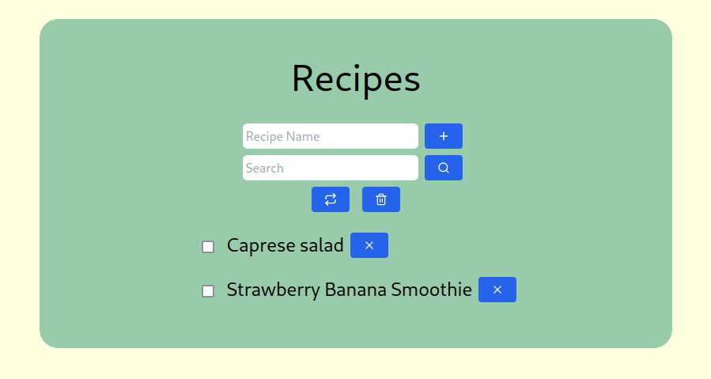
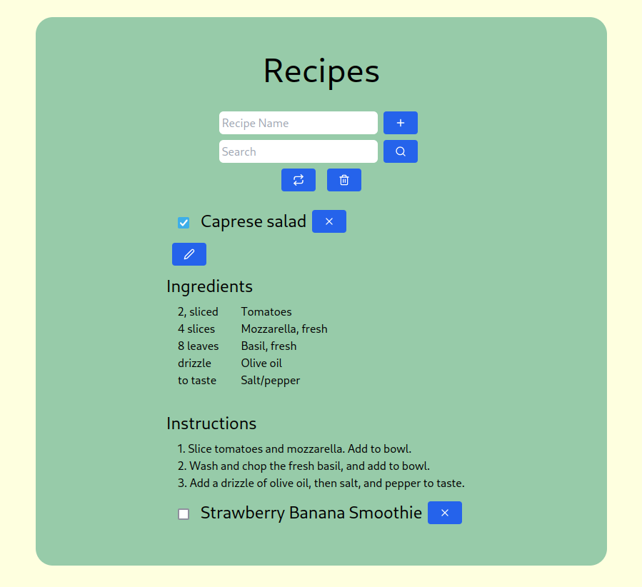
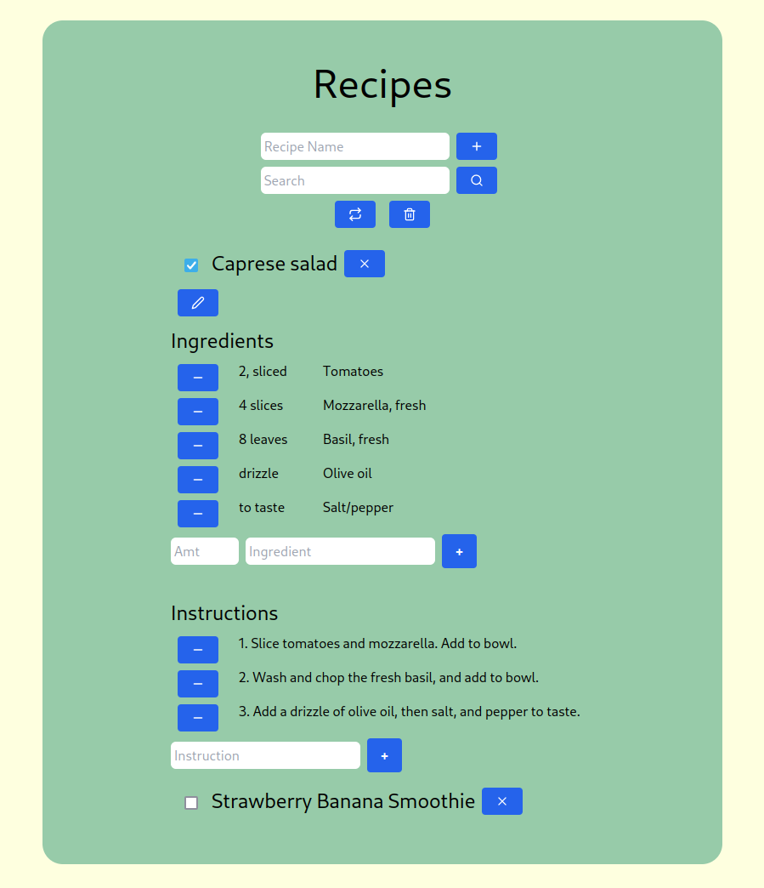

# React Recipes

React Recipes is a basic recipe storage app written using the React javascript library.
Feel free to try it out at: [https://cw417.github.io/react-recipes/](https://cw417.github.io/react-recipes/)

## How It Works

* React Recipes uses javascript, the React library, and TailwindCSS for styling.
* All data is saved to local storage in the user's browser.

## Usage

* Users can enter a recipe name to add it to the list of recipes.
* Once entered, the recipe will be displayed so that the user can select and edit each recipe individually.
* Recipes can also be removed from the list via the ( X ) button to the right of the recipe name.
* If a recipe is removed from the list, it is possible to restore it via the ( &#10227; ) button
* Recipes can be expanded via the checkbox to show their ingredients and instructions.
* Once expanded, the user has access to the ( &#128393; ) button to toggle the editing controls.
* Editing controls consist of:
  * Adding new ingredients and instructions via the inputs and ( + ) buttons.
  * Removing current ones via the ( - ) button.
* A search field is provided to filter the recipe list based on a provided keyword.
  * The search is case-insensitive.
  * The search will show any recipes where the name or any ingredients contain the keyword.
  * Once the user has performed a search, the restore ( &#10227; ) button can be used to restore the full recipe list.

## Examples

Starting page:

Recipe selected:

Editing selected recipe:
